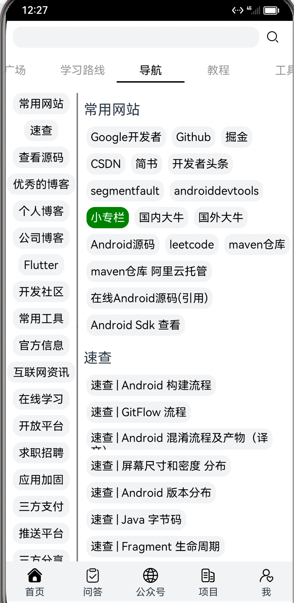

## FlowLayout

流式标签布局，效果如下：



## 安装命令

```
ohpm install @luyao/flowlayout
```

## 使用说明

```ArkTs
FlowLayout({
  // 数据源 string[]
  data: datas, 
  // 标签配置
  flowLayoutConfig: new FlowLayoutConfig() 
    .setItemFontSize(16)
    ...,
  // 点击事件
  clickListener: (index: number) => {
   
  }
})
```

FlowLayoutConfig 支持的属性：

| 方法                       | 说明         | 默认值         |
|--------------------------|------------|-------------|
| setItemNormalFontColor   | 未选中标签字体颜色  | Color.Black |
| setItemSelectedFontColor | 选中标签字体颜色   | Color.White |
| setItemFontSize          | 标签字体大小     | 14          |
| setItemNormalBgColor     | 未选中标签背景色   | Color.Grey  |
| setItemSelectedBgColor   | 选中标签背景色    | Color.Green |
| setItemHeight            | 标签高度       | 30          |
| setItemBorderRadius      | 标签圆角       | 12          |
| setItemBorderWidth       | 标签边框宽度     | 0           |
| setItemBorderColor       | 标签边框颜色     | undefined   |
| setItemPadding           | 标签 padding | 8           |
| setItemMargin            | 标签 margin  | 4           |


